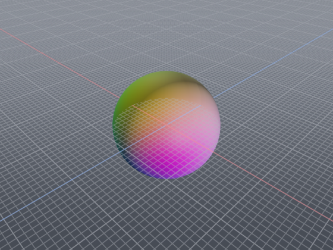
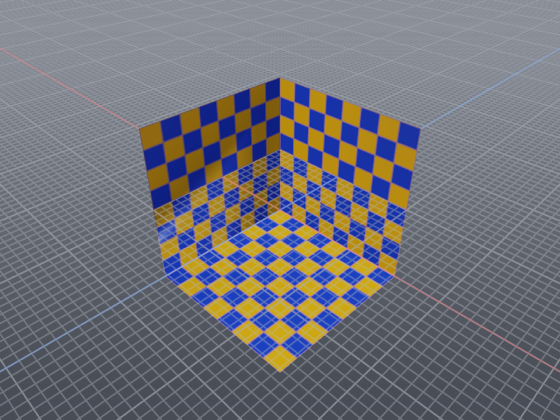
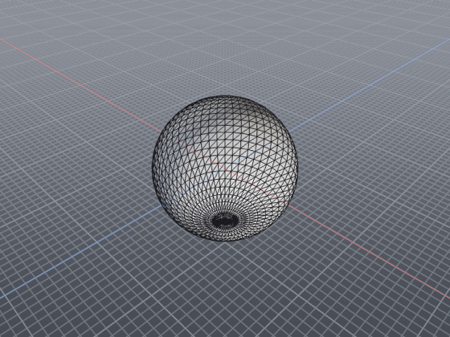
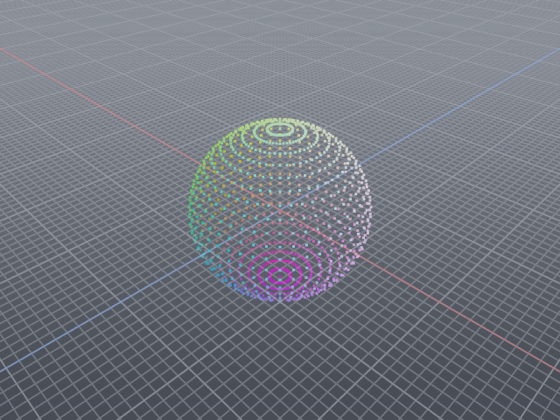

<div align="center">

# Tessera

**A small, sharp 3D model viewer.**

Opens about seventy formats, renders them with physically-based shading, and
doubles as a format converter and a headless thumbnailer.

[](https://github.com/sarp64/tessera/actions/workflows/ci.yml)
[](#platform-support)
[](LICENSE)
[](#building-from-source)
[](docs/BACKENDS.md)






<sub>All four produced by Tessera's own headless renderer: `tessera model.ply -r out.png`.</sub>

</div>

---

## Contents

- [Why it exists](#why-it-exists)
- [Install](#install)
- [Three ways to run it](#three-ways-to-run-it)
- [Formats](#formats)
- [Controls](#controls)
- [Building from source](#building-from-source)
- [Platform support](#platform-support)
- [Documentation](#documentation)
- [Contributing](#contributing)

## Why it exists

Most 3D viewers pick a side. Either they are tiny and read three formats, or
they read everything and arrive as a hundred-megabyte application with a project
browser and an asset pipeline.

Tessera takes the position that those two goals only conflict if you let format
parsing leak into the rest of the program. Everything here is built around one
format-agnostic scene representation. Importers fill it, the renderer draws it,
the exporter writes it back out, and none of them know about each other. The
result reads about seventy formats in roughly six thousand lines.

Three concrete consequences:

- **Adding a format is one file and one line.** No other file changes.
- **The core has no window.** `tessera_core`, scene plus all file I/O, links
  without OpenGL, GLFW or any UI, so conversion and tests never drag in a
  renderer.
- **The renderer is swappable.** Everything above `IRenderBackend` is
  graphics-API agnostic.

## Install

### Download

Grab the latest `.dmg` from the [releases page](../../releases), open it, and
drag Tessera to Applications.

> **First launch:** the app is signed ad-hoc rather than with an Apple Developer
> ID, so Gatekeeper will refuse it once with *"Tessera cannot be opened because
> the developer cannot be verified."* Right-click the app → **Open** → confirm.
> You only need to do this once. Or:
> ```bash
> xattr -dr com.apple.quarantine /Applications/Tessera.app
> ```

### Command line

The bundled binary is the same one the CLI modes use:

```bash
ln -s /Applications/Tessera.app/Contents/MacOS/Tessera /usr/local/bin/tessera
```

## Three ways to run it

**Viewer.** Drop a model on the window, or pass one:

```bash
tessera model.glb
```

**Converter.** Reads any supported format, writes any writable one:

```bash
tessera part.step -o part.stl --ascii
tessera scan.ply  -o scan.glb
```

**Headless renderer.** No window is ever created, which suits batch
thumbnailing a directory:

```bash
tessera model.fbx -r thumb.png -s 512x512 --transparent
for f in *.obj; do tessera "$f" -r "${f%.obj}.png" -s 256x256; done
```

Run `tessera --help` for the rest.

## Formats

```bash
tessera --formats          # ~70 readable
tessera --export-formats   # 16 writable
```

**OBJ**, **STL** and **PLY** have hand-written readers. They parse the whole
file in one pass with an in-place number scanner rather than streaming, which is
what makes them quick on the multi-million-triangle dumps those three formats
attract. The PLY reader handles ASCII, binary little- and big-endian, and falls
back to a point cloud when a file has no faces, the usual shape of LiDAR and
photogrammetry exports.

Everything else goes through [Assimp](https://github.com/assimp/assimp): glTF /
GLB, FBX, COLLADA, 3DS, BLEND, DXF, X3D, LWO, MD5, STEP and the rest.

Importers are tried in priority order, so a fast reader can decline an exotic
variant and let the general one pick it up. Nothing fails just because the
specialised path was too strict.

## Controls

| Input | Action |
| --- | --- |
| Left / middle drag | Orbit |
| Shift + drag, right drag | Pan |
| Wheel | Zoom |
| Left click | Select mesh, or drop a measurement point |
| <kbd>F</kbd> / <kbd>Shift</kbd>+<kbd>F</kbd> | Frame all / frame selection |
| <kbd>1</kbd> <kbd>3</kbd> <kbd>7</kbd> <kbd>0</kbd> | Front / right / top / isometric |
| <kbd>Ctrl</kbd> + <kbd>1</kbd> <kbd>3</kbd> <kbd>7</kbd> | Back / left / bottom |
| <kbd>5</kbd> | Toggle orthographic |
| <kbd>W</kbd> <kbd>N</kbd> <kbd>B</kbd> <kbd>G</kbd> <kbd>T</kbd> | Wireframe, normals, bounds, grid, textures |
| <kbd>C</kbd> | Cycle shading mode |
| <kbd>M</kbd> | Measure tool |
| <kbd>H</kbd> / <kbd>Alt</kbd>+<kbd>H</kbd> | Hide selected / show all |
| <kbd>Space</kbd> | Turntable |
| <kbd>Tab</kbd> | Hide panels (fullscreen viewport) |
| <kbd>F11</kbd> / <kbd>F12</kbd> | Fullscreen window / screenshot |
| <kbd>Ctrl</kbd>+<kbd>O</kbd> <kbd>E</kbd> <kbd>R</kbd> | Open / export / reload |

Ten shading modes: shaded (PBR), clay, base colour, normals, tangents, UV,
metallic, roughness, occlusion and vertex colour. The inspection modes exist
because "why is this model black" is usually answered by looking at its normals.

## Building from source

You need a C++20 compiler, CMake 3.21+, Python 3 (used once, to generate the
OpenGL loader) and git. Everything else is either found on your system or
fetched and built from source.

```bash
git clone <this repo> && cd tessera
cmake --preset macos
cmake --build --preset macos
./build/macos/bin/tessera
```

### Presets

| Preset | What it gives you |
| --- | --- |
| `macos` | Release build against system/Homebrew dependencies, fastest to build |
| `macos-debug` | Same, with debug info |
| `macos-metal` | Adds the [Metal backend](docs/BACKENDS.md) (device detection only) |
| `macos-universal` | arm64 + x86_64, all dependencies from source |
| `macos-dmg` | Universal, bundled as `Tessera.app` in a `.dmg` |

### Producing a `.dmg`

`cmake --preset macos-dmg`, build, then `cpack`. The bundle is self-contained,
with every dependency compiled from a pinned revision so nothing links against
Homebrew. [RELEASING.md](RELEASING.md) has the full procedure and the checks
worth running before publishing.

### Tests

```bash
ctest --test-dir build --output-on-failure
```

Fifteen smoke tests, split by label so they stay useful on machines without a
graphics context:

| Label | Covers | Needs a GPU? |
| --- | --- | --- |
| `cli` | argument handling, the importer and exporter registries | no |
| `convert` | every native reader, plus a round trip through Assimp | no |
| `render` | headless PNG output, checked down to the file signature | yes |

`ctest -LE render` runs everything that works anywhere, which is most of the
project: `tessera_core` links without OpenGL, so the whole import and export
path is testable headless. `ctest -L render` runs just the graphics tests.

### Benchmarks

There is a built-in benchmark mode, so renderer changes get measured rather than
argued about:

```bash
python3 benchmarks/make_scenes.py
tessera benchmarks/scenes/many.obj --benchmark 300 -s 1280x800 -q
```

[BENCHMARK.md](BENCHMARK.md) covers the methodology and what previous changes
were worth. Read it before quoting a number: absolute timings belong to the
machine that produced them, and anything under roughly 10% is noise.

### Options

| Option | Default | Meaning |
| --- | --- | --- |
| `TESSERA_WITH_ASSIMP` | ON | Assimp backend (~50 of the formats) |
| `TESSERA_WITH_UI` | ON | Dear ImGui interface |
| `TESSERA_PREFER_BUNDLED_DEPS` | OFF | Always build dependencies from source |
| `TESSERA_MACOS_BUNDLE` | OFF | Build as `Tessera.app` instead of a plain binary |
| `TESSERA_BACKEND_*` | OpenGL only | Render backends to compile in |
| `TESSERA_WERROR` | OFF | Warnings become errors |

### Compiler floor

`std::format` and friends landed late in every standard library, so CMake checks
up front and fails with a readable message rather than a template avalanche.

| Toolchain | Minimum |
| --- | --- |
| Apple Clang | 15 |
| Clang | 16 |
| GCC | 13 |
| MSVC | 19.29 (VS 2019 16.10) |

## Platform support

**macOS is the only platform the app has actually been used on.** Linux and
Windows build and pass the test suite in CI, but that happens on a headless
virtual machine with no GPU. It proves the code compiles and the logic is
correct; it does not prove the application behaves properly on a real desktop
with real drivers.

| Platform | Builds | Tests | Used on real hardware |
| --- | --- | --- | --- |
| macOS 13.3+ (Apple silicon and Intel) | yes | 15/15 | yes |
| Linux | in CI | 15/15, rendering via Xvfb and llvmpipe | not yet |
| Windows | in CI | 13/13 headless; rendering not exercised | not yet |

Worth stating plainly:

- **Windows CI never renders anything.** GitHub's runners offer only OpenGL
  1.1, below the 3.3 core requirement, so the graphics path is compiled there
  but never executed.
- **No CI machine has a GPU.** Linux rendering is verified through Mesa's
  software rasteriser, which exercises the shaders and the pipeline but not any
  real driver.
- **Nothing interactive is covered anywhere but macOS.** Window management,
  high-DPI behaviour, input handling and the desktop file-open integration are
  untested off macOS.

So: treat Linux and Windows as "compiles and the logic works", not as
supported. If you run it on either, reports are genuinely welcome.

## Documentation

The README covers using Tessera. The rest lives in `docs/`, so that this page
stays readable for someone who just wants to open a model.

| Document | What is in it |
| --- | --- |
| [ARCHITECTURE.md](docs/ARCHITECTURE.md) | The seams the design rests on, the invariants to respect, and why several odd-looking decisions are the way they are |
| [FORMATS.md](docs/FORMATS.md) | Writing an importer or exporter, and the mistakes that catch people out |
| [BACKENDS.md](docs/BACKENDS.md) | The `IRenderBackend` contract, the state of each backend, and what finishing one actually involves |
| [BENCHMARK.md](BENCHMARK.md) | Measuring the renderer, the noise floor, and past results |
| [RELEASING.md](RELEASING.md) | Cutting a release, and signing and notarisation |

## Contributing

Issues and pull requests are welcome. Things that would genuinely help:

- **Run it on real Linux or Windows hardware** and report what breaks. CI proves
  it compiles and the logic holds on a virtual machine; it says nothing about
  actual drivers, window managers or GPUs. This is the single most useful
  contribution right now, and there is an
  [issue template](../../issues/new?template=platform_bug.yml) that asks for
  exactly the details needed to act on it.
- **Finish a render backend.** The seam is in place and OpenGL is a working
  reference; [BACKENDS.md](docs/BACKENDS.md) has the contract and the costs
  that are easy to underestimate.
- **New format readers**, especially ones Assimp handles poorly.
  [FORMATS.md](docs/FORMATS.md) is a complete walkthrough.
- **Test models** that break the importers. Malformed files are welcome.

Match the surrounding style: descriptive names, comments that explain *why*
rather than restating the code, and no new dependencies without a good reason.

## Acknowledgements

Tessera stands on [Assimp](https://github.com/assimp/assimp),
[GLFW](https://github.com/glfw/glfw), [glm](https://github.com/g-truc/glm),
[Dear ImGui](https://github.com/ocornut/imgui),
[stb](https://github.com/nothings/stb) and
[glad](https://github.com/Dav1dde/glad).

## License

[MIT](LICENSE).
